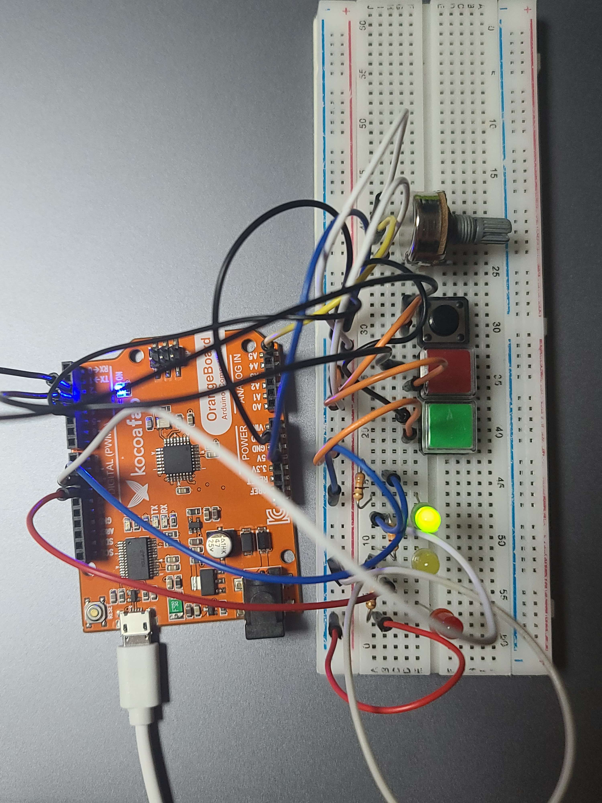
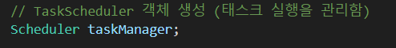
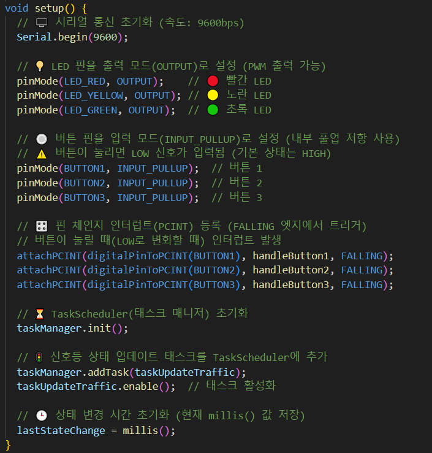
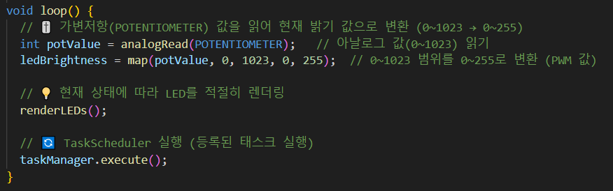
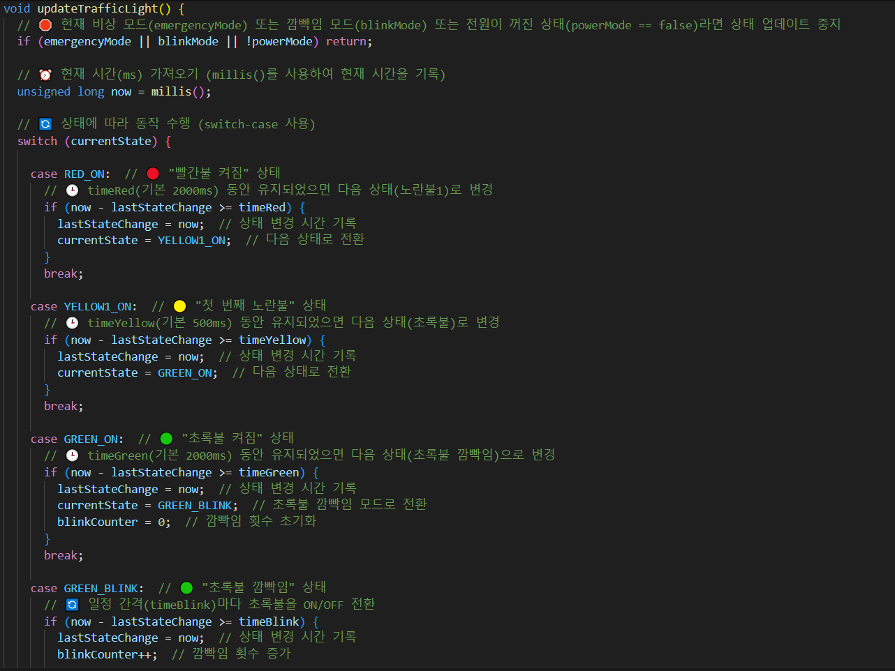
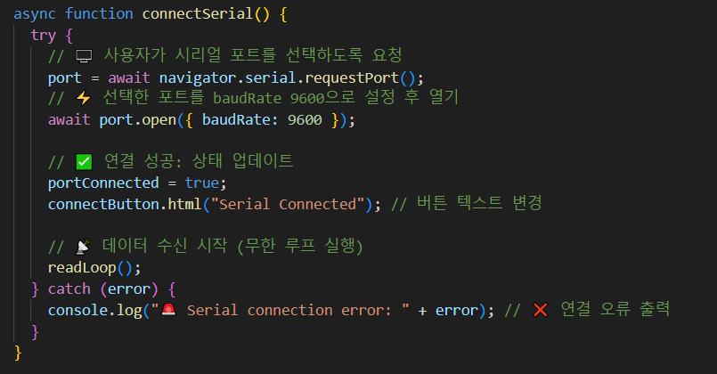
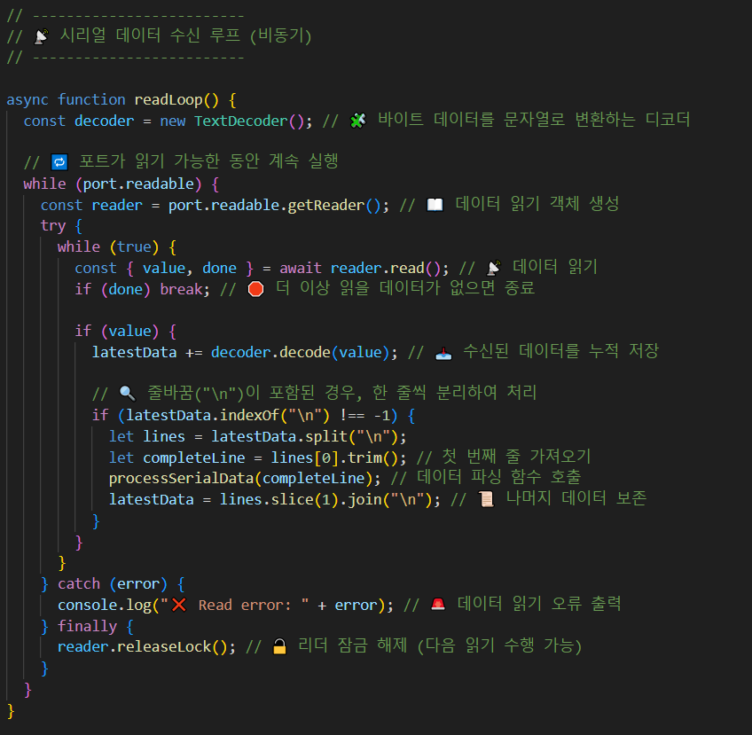
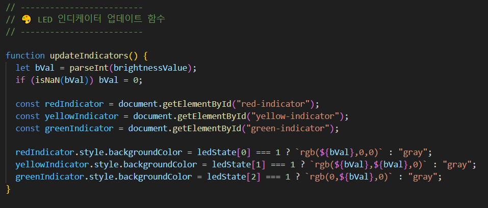

# 🚦 **Traffic Light Controller (신호등 제어 시스템)**  

### 📽️ **동작 영상**
- [유튜브 영상 링크](https://youtu.be/예시링크)  
  *(본 영상에서는 회로 구성, 코드 설명, 실행 과정 등을 상세히 설명하였습니다.)*  

---

## 📜 **프로젝트 개요**
이 프로젝트는 **아두이노(Arduino)와 p5.js를 활용한 신호등 제어 시스템**입니다.  
웹 인터페이스에서 **시리얼 통신(Web Serial API)** 을 이용하여 **신호등 동작을 조작**하고,  
가변저항(Potentiometer)을 이용해 LED 밝기를 조절할 수 있습니다.

✅ **주요 기능**  
- **모드 전환 버튼** → 긴급 모드(빨간불 고정), 점멸 모드(전체 깜빡임), 전원 모드  
- **가변저항** → LED 밝기 조절  
- **웹 UI(p5.js 활용)** → 신호등 상태 시각화 및 지속시간 조절  
- **시리얼 통신** → 아두이노 ↔ 웹 간 데이터 교환  

---

## 🛠️ **회로 구성 (Circuit Diagram)**  

### **1️⃣ 전체 회로 구성**
  

### **2️⃣ 사용 부품**
| 부품명 | 역할 | 연결 핀 |
|--------|------|--------|
| Arduino Uno | 마이크로컨트롤러 | - |
| LED (3개) | 신호등 (빨강, 노랑, 초록) | 11, 10, 9 |
| 저항 (330Ω) | LED 전류 제한 | LED 직렬 연결 |
| 버튼 (3개) | 모드 전환 | 4, 3, 2 |
| 가변저항 (Potentiometer) | LED 밝기 조절 | A5 |
| USB 케이블 | PC ↔ Arduino 통신 | - |

### **3️⃣ 버튼 핀 신호 설정**
- **기본 상태(Default Signal)**: `HIGH (5V)`
- **버튼을 누를 때**: `LOW (0V)`
- **내부 풀업 저항(Pull-up Resistor) 활성화**: `INPUT_PULLUP` 설정  
  *(따라서 외부 저항이 필요 없음)*  

---

## 🖥️ **소프트웨어 구성**
### **1️⃣ 주요 코드 설명**
본 프로젝트의 핵심 코드는 **아두이노 (C++) 코드**와 **웹 프론트엔드 (p5.js, JavaScript)** 두 부분으로 나뉩니다.

### 📌 1. Arduino 코드 구성
📌 TaskScheduler 객체 생성
아두이노에서 TaskScheduler 라이브러리를 사용하여 신호등 제어 태스크를 생성함.
  

📌 setup 함수
아두이노 핀을 설정하고, 버튼 인터럽트를 등록하는 부분.
  

📌 loop 함수
메인 루프에서 가변저항 값을 읽어 LED 밝기를 조절하고, 태스크 실행.
 

📌 신호등 상태 머신
신호등이 빨간불 → 노란불 → 초록불 → 깜빡임 → 노란불 → 빨간불 순서로 변경됨.
 

### 📌 2. JavaScript (p5.js) 코드 구성
📌 시리얼 포트 연결 (Web Serial API)
사용자가 "Connect Serial" 버튼을 눌러 아두이노와 연결할 수 있도록 구현됨.
 

📌 시리얼 데이터 수신 및 파싱
아두이노에서 보낸 데이터를 받아서 LED 상태 및 모드 정보를 UI에 반영하는 부분.
 

📌 LED 상태 업데이트
아두이노에서 받은 데이터에 따라 웹 인터페이스의 LED 색상 변경.
 

## 📌 3. 프로젝트 실행 방법
1️⃣ 아두이노 코드 업로드
Arduino IDE 또는 PlatformIO를 사용하여 아두이노에 코드 업로드
보드: Arduino Uno
9600bps 시리얼 통신 설정

2️⃣ 웹 인터페이스 실행
index.html을 실행하거나, Live Server를 사용
Chrome 브라우저에서 실행 (Web Serial API 지원 필요)

3️⃣ 시리얼 포트 연결
"Connect Serial" 버튼 클릭 후 아두이노 포트 선택
슬라이더를 조작하여 각 LED 지속시간 변경 가능

4️⃣ 신호등 동작 확인
아두이노 LED가 웹 UI와 동기화되어 작동해야 함
슬라이더 값 변경 시 즉시 반영
